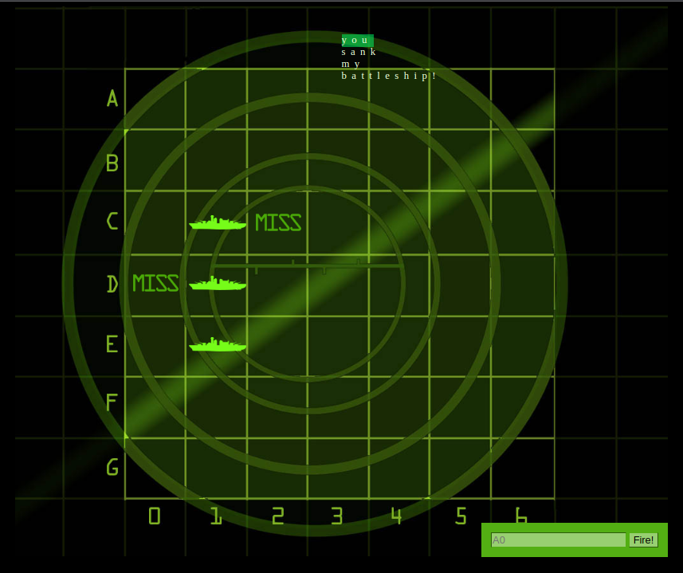

# Course Notes: Head First Javascript Programming
This repo contains notes taken from the book "Head first javascript programming" along with the book's main project. [Book's link](https://www.oreilly.com/library/view/head-first-javascript/9781449340124/)

>**Purpose**
- Learn Javascript from the very basics to advanced topics and have a knowledge reference.

>**Topics discussed**
- Variables and naming
- While, if
- Functions, parameters/arguments/returns, function variable scopes
- Flow of execution
- Arrays
- For loops
- Objects, Objects with functions, 
- DOM Manipulation
- Equality, truthy/falsely
- Event handlers
- Timeouts
- Asynchronous functions, closures, lexical scope, Function environments
- Object constructors, Date objects
- Array methods
- Object prototypes
- Regular Expressions

>**Result**
- By the end of the book a browser game is developed where users can enter the location of hidden ships on a radar-like table in an input field and the entered locations will show if the user did hit or miss.  [Try it here]

